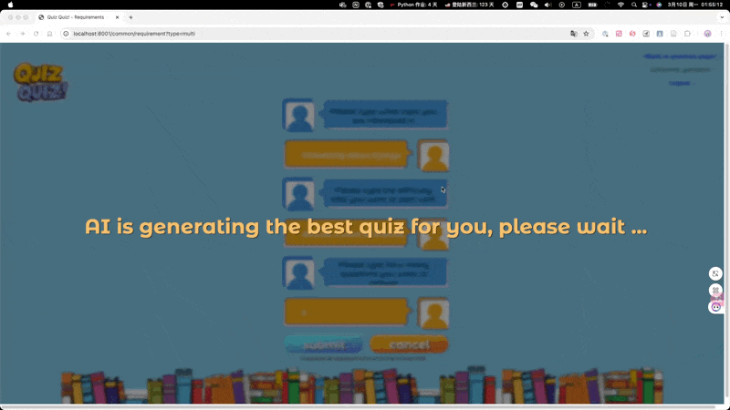
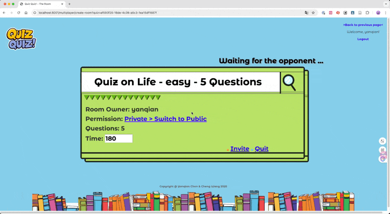

# online_quiz_pk_system
<center>
  
  <br>
  [An online example: www.quizquiz.fun](https://www.quizquiz.fun)
</center>

# Introduction

This Python Django-based application provides an AI-driven quiz platform, offering both single-player and two-player (
PvP) modes. In both modes, users initiate the quiz generation process by specifying their desired domain, difficulty
level, and number of questions. The application then leverages AI to dynamically create tailored question sets.

For PvP mode, the application features room creation, private friend invitations, and public room listings to facilitate
competitive gameplay.

Upon completion of quizzes in either single-player or PvP modes, users receive comprehensive post-quiz reports. These
reports detail performance metrics, including time spent on each question, and provide detailed explanations for each
answer.

# Features
- AI-Powered Question Generation:
Dynamically generates quizzes using AI, ensuring fresh and engaging content.
AI-driven question creation for diverse and challenging quizzes.
Experience quizzes that are intelligently crafted by AI.
- Versatile Game Modes:
Single-Player Mode: Practice and improve your knowledge solo with AI-generated quizzes.
Two-Player PvP Mode: Challenge friends or other players in real-time competitive quizzes.
Choose between solo practice and exciting player-versus-player battles.
- Customizable Quiz Parameters:
Domain Selection: Choose specific knowledge domains for focused quizzes.
Difficulty Levels: Select from various difficulty levels to match your skill.
Number of Questions: Customize the quiz length to fit your time and learning goals.
Tailor quizzes to your interests and skill level by adjusting domain, difficulty, and length.
- Robust PvP Room System (Two-Player Mode Specific):
Room Creation: Easily create private rooms to challenge specific friends.
Friend Invitation: Invite friends directly to your private quiz rooms.
Public Room Listings: Discover and join public rooms for open competition.
Engage in PvP battles with friends or other players through a comprehensive room system.
- Detailed Post-Quiz Reports:
Performance Metrics: Track your score, accuracy, and overall performance.
Question Time Tracking: Analyze time spent on each question to identify areas for improvement.
Answer Explanations: Review detailed explanations for each question to enhance learning.
Gain valuable insights into your quiz performance with comprehensive reports.

# Project Structure
``` 
online_quiz_pk_system/
├── common/ # Common functionalities
├── media/ # Media files
├── multiplayer/ # Multiplayer functionalities
│   ├── migrations/ # Database migrations
│   ├── services/ # Services
│   ├── __init__.py  
│   ├── admin.py # Admin
│   ├── apps.py # App configuration
│   ├── consumers.py # Websocket consumers
│   ├── models.py # Models
│   ├── tests.py # Tests
│   ├── urls.py # Urls
│   └── views.py # Views
├── online_quiz_pk_system/
│   └── readme
├── singleplayer/ # Singleplayer functionalities
├── static/
├── templates/
├── venv/
├── .gitattributes
├── .gitignore
├── manage.py
├── README.md
└── requirements.txt
```

# Display
- Home Page

- Custom Quiz Page

- AI Generating Questions

- Single Player Mode

- Multiplayer Index Page

- Multiplayer Room Page


- Multiplayer Match

